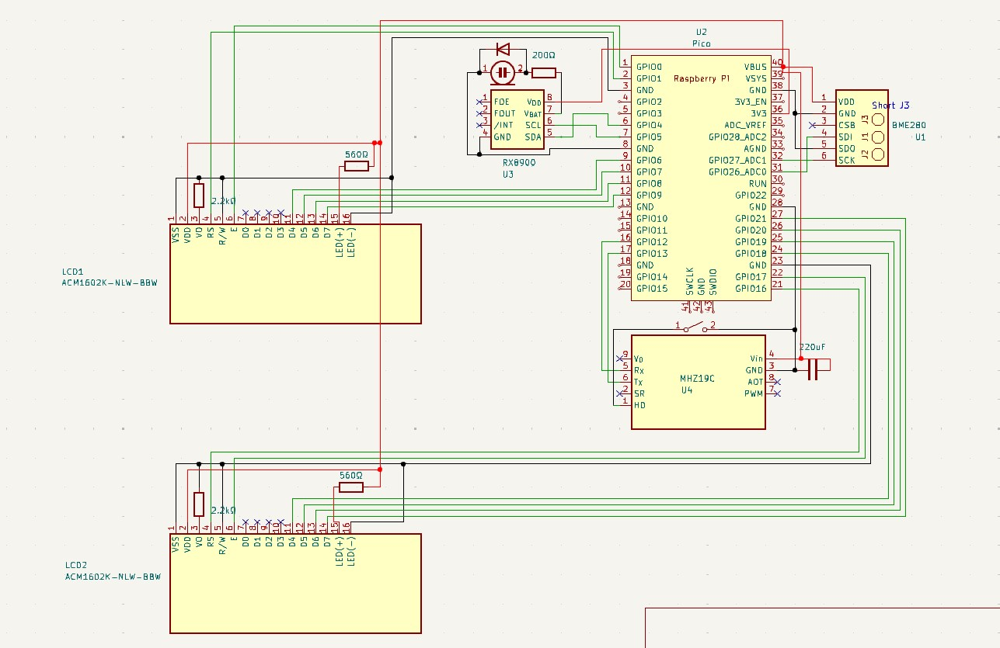

# About
温度、湿度、気圧、二酸化炭素濃度、時間を毎秒表示する室内用汎用モニタです。
秋月電子の16×2行のLCDモジュールが安かったのでデュアルディスプレイにしました。

BME280とMHZ19CのソースコードについてはShapocoさんからお借りしました。
https://github.com/shapoco/pico-env-mon

# Electronic Components
|項目|型番|購入先|
|:--|:--|:--|
|マイコン|Raspberry Pi Pico|https://akizukidenshi.com/catalog/g/g116132/|
|LCD|ACM1602K-NLW-BBW *2|https://akizukidenshi.com/catalog/g/g110185/|
|温湿度・気圧センサ|AE-BME280|https://akizukidenshi.com/catalog/g/g109421/|
|CO2 センサ|MH-Z19C|https://akizukidenshi.com/catalog/g/g116142/|
|Zero Point Calibration スイッチ|適当なタクトスイッチ|https://akizukidenshi.com/catalog/g/g103647/|
|電気二重層コンデンサー|1.5F5.5V|https://akizukidenshi.com/catalog/g/g104300/|
|整流用ダイオード|1000V1A|https://akizukidenshi.com/catalog/g/g100934/|
|抵抗|2.2kΩ *2|手持ち|
||560kΩ *2|手持ち|
||200kΩ|手持ち|
|ピンヘッダ||手持ち|
|ユニバーサル基板|2.54mmピッチ 7*9cm|https://www.amazon.co.jp/gp/product/B0CX1P8M42/ref=ppx_yo_dt_b_asin_title_o02_s00?ie=UTF8&psc=1|
|配線|UEW|https://akizukidenshi.com/catalog/g/g109583/|
||耐熱電子ワイヤ|https://akizukidenshi.com/catalog/g/g110672|
|USB電源|5V|手持ち|
|microUSBケーブル||手持ち|

# Wiring
ユニバーサル基盤を二層にして、LCDデュアルディスプレイを１層目、その他を2層目にしました。
